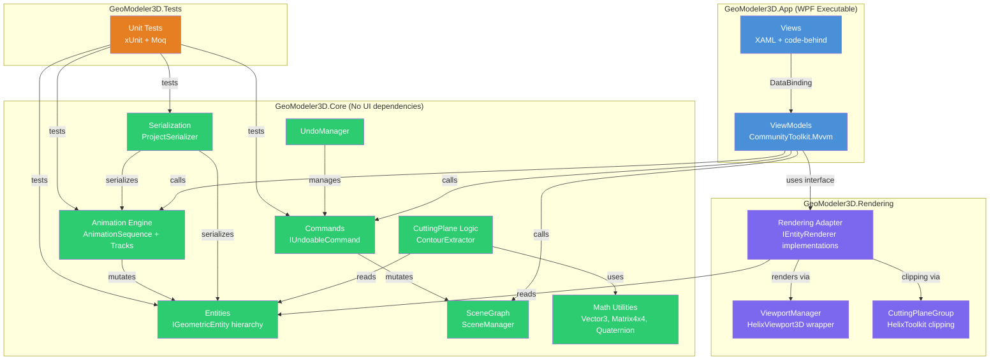
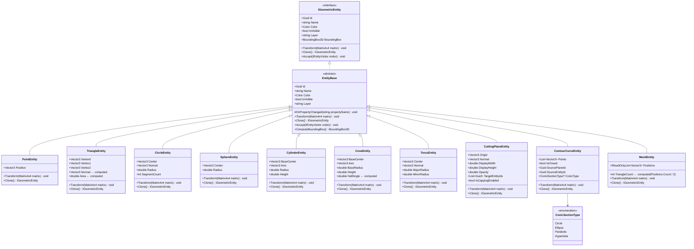
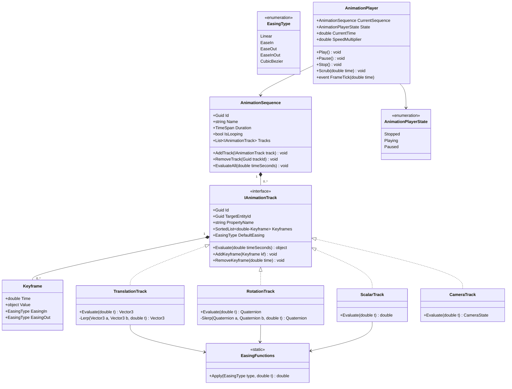
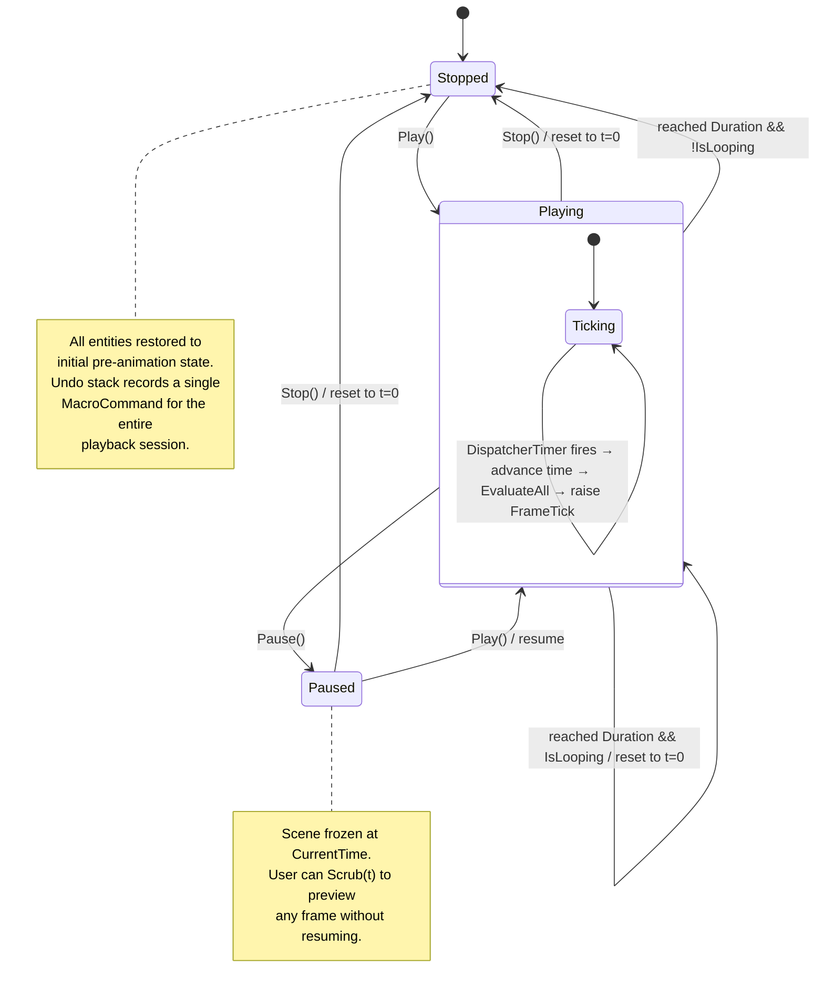
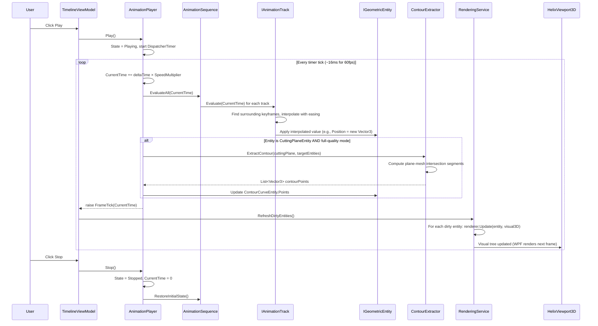
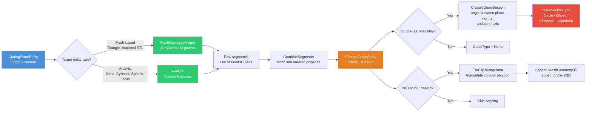
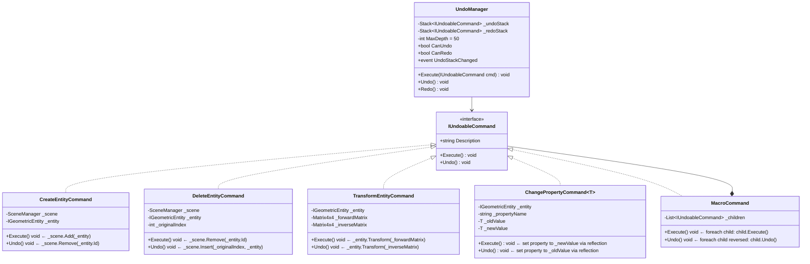
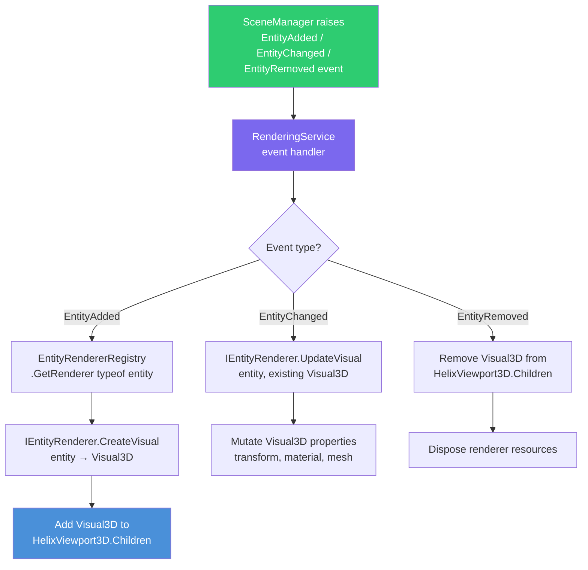
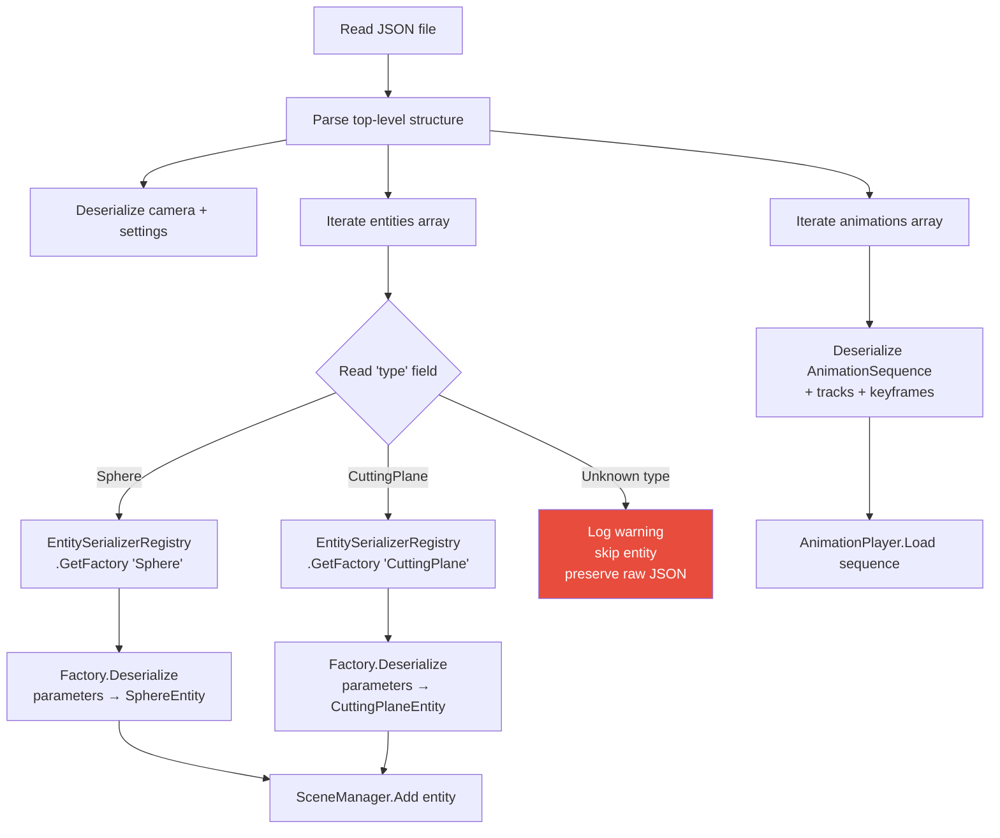
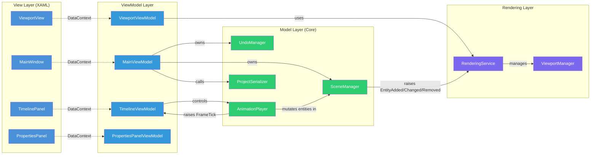

# Architecture Document — GeoModeler3D

**Project Name:** GeoModeler3D  
**Version:** 1.2
**Date:** March 2026
**Status:** Draft
**Audience:** AI coding assistants, developers, and architects. This document is structured for machine-parseable consumption with explicit naming conventions, dependency rules, and interface contracts.
**Change Log:** v1.2 — Added `MeshEntity`, `WrlImporter`, `MeshEntityRenderer`; updated folder structure, class diagram, `IEntityVisitor`, serialization schema, DI setup, import data flow, and visibility handling pattern.

---

## 1. Architecture Overview

GeoModeler3D is a C# / .NET 8 / WPF desktop application following a strict **MVVM (Model-View-ViewModel)** layered architecture. The solution is decomposed into four projects with unidirectional dependency flow. The 3D rendering is powered by **HelixToolkit.Wpf** and isolated behind an adapter layer so the graphics backend can be swapped without touching domain logic.

### 1.1 High-Level Layer Diagram



### 1.2 Dependency Rules (Strictly Enforced)

| Project | May Reference | Must NOT Reference |
|---------|--------------|-------------------|
| `GeoModeler3D.Core` | `System.*`, `System.Text.Json`, `System.Numerics` | Any WPF assembly, HelixToolkit, any UI library |
| `GeoModeler3D.Rendering` | `GeoModeler3D.Core`, `HelixToolkit.Wpf`, `System.Windows.Media.Media3D` | `GeoModeler3D.App`, any ViewModel |
| `GeoModeler3D.App` | `GeoModeler3D.Core`, `GeoModeler3D.Rendering`, `CommunityToolkit.Mvvm`, WPF assemblies | Direct HelixToolkit types in ViewModels (use interfaces) |
| `GeoModeler3D.Tests` | `GeoModeler3D.Core`, `GeoModeler3D.Rendering`, `xunit`, `Moq` | `GeoModeler3D.App` |

---

## 2. Solution and Folder Structure

```
GeoModeler3D/
├── GeoModeler3D.sln
├── docs/
│   ├── Requirement_Document.md
│   ├── Technology_Choice.md
│   └── Architecture.md                          ← this file
├── src/
│   ├── GeoModeler3D.Core/
│   │   ├── GeoModeler3D.Core.csproj              ← TargetFramework: net8.0 (NOT net8.0-windows)
│   │   ├── Entities/
│   │   │   ├── IGeometricEntity.cs
│   │   │   ├── EntityBase.cs                     ← abstract base implementing IGeometricEntity
│   │   │   ├── PointEntity.cs
│   │   │   ├── TriangleEntity.cs
│   │   │   ├── CircleEntity.cs
│   │   │   ├── SphereEntity.cs
│   │   │   ├── CylinderEntity.cs
│   │   │   ├── ConeEntity.cs
│   │   │   ├── TorusEntity.cs
│   │   │   ├── CuttingPlaneEntity.cs
│   │   │   ├── ContourCurveEntity.cs
│   │   │   ├── MeshEntity.cs                     ← flat Vector3[] positions; every 3 = one triangle
│   │   │   └── ConicSectionType.cs               ← enum: Circle, Ellipse, Parabola, Hyperbola
│   │   ├── SceneGraph/
│   │   │   ├── SceneManager.cs                   ← owns ObservableCollection<IGeometricEntity>
│   │   │   ├── LayerManager.cs
│   │   │   └── SelectionManager.cs
│   │   ├── Commands/
│   │   │   ├── IUndoableCommand.cs
│   │   │   ├── UndoManager.cs
│   │   │   ├── CreateEntityCommand.cs
│   │   │   ├── DeleteEntityCommand.cs
│   │   │   ├── TransformEntityCommand.cs
│   │   │   ├── ChangePropertyCommand.cs
│   │   │   └── MacroCommand.cs                   ← groups multiple commands (e.g., animation playback)
│   │   ├── Operations/
│   │   │   ├── IEntityVisitor.cs                 ← Visitor pattern interface
│   │   │   ├── TransformOperation.cs
│   │   │   ├── DuplicateOperation.cs
│   │   │   ├── MeasurementService.cs
│   │   │   ├── BoundingBoxQuery.cs
│   │   │   └── ContourExtractor.cs               ← plane-mesh intersection → contour segments
│   │   ├── Animation/
│   │   │   ├── AnimationSequence.cs
│   │   │   ├── IAnimationTrack.cs
│   │   │   ├── TranslationTrack.cs
│   │   │   ├── RotationTrack.cs
│   │   │   ├── ScalarTrack.cs
│   │   │   ├── CameraTrack.cs
│   │   │   ├── Keyframe.cs
│   │   │   ├── EasingType.cs                     ← enum: Linear, EaseIn, EaseOut, EaseInOut, CubicBezier
│   │   │   ├── EasingFunctions.cs                ← static class with interpolation math
│   │   │   ├── AnimationPlayer.cs                ← state machine: Stopped → Playing → Paused
│   │   │   └── AnimationExporter.cs              ← frame-by-frame PNG capture logic
│   │   ├── Serialization/
│   │   │   ├── ProjectSerializer.cs
│   │   │   ├── ProjectFileSchema.cs              ← DTO classes for JSON mapping
│   │   │   ├── IEntitySerializerFactory.cs
│   │   │   ├── EntitySerializerRegistry.cs       ← type-discriminator → factory mapping
│   │   │   └── AutoSaveService.cs
│   │   ├── Import/
│   │   │   ├── IFileImporter.cs
│   │   │   ├── CsvPointCloudImporter.cs
│   │   │   ├── StlImporter.cs                    ← ASCII + binary STL; no NuGet; pure BinaryReader/StreamReader
│   │   │   ├── ObjImporter.cs                    ← v/f lines; fan-triangulates N-gons; handles i/t/n syntax
│   │   │   ├── WrlImporter.cs                    ← VRML 2.0; IndexedFaceSet blocks; fan-triangulates faces
│   │   │   ├── PlyImporter.cs
│   │   │   └── ImportValidationResult.cs
│   │   ├── Export/
│   │   │   ├── IFileExporter.cs
│   │   │   ├── StlExporter.cs
│   │   │   ├── ObjExporter.cs
│   │   │   └── PlyExporter.cs
│   │   └── Math/
│   │       ├── Plane3D.cs                        ← Origin + Normal, distance-to-point, side classification
│   │       ├── BoundingBox3D.cs
│   │       ├── MathConstants.cs
│   │       └── GeometryUtils.cs                  ← line-plane intersection, angle computation, etc.
│   │
│   ├── GeoModeler3D.Rendering/
│   │   ├── GeoModeler3D.Rendering.csproj         ← TargetFramework: net8.0-windows
│   │   ├── IEntityRenderer.cs                    ← interface: Render(entity) → Visual3D
│   │   ├── IRenderingService.cs                  ← interface consumed by ViewModels
│   │   ├── RenderingService.cs                   ← orchestrates entity→Visual3D mapping
│   │   ├── ViewportManager.cs                    ← wraps HelixViewport3D lifecycle
│   │   ├── EntityRenderers/
│   │   │   ├── PointEntityRenderer.cs
│   │   │   ├── TriangleEntityRenderer.cs
│   │   │   ├── CircleEntityRenderer.cs
│   │   │   ├── SphereEntityRenderer.cs
│   │   │   ├── CylinderEntityRenderer.cs
│   │   │   ├── ConeEntityRenderer.cs
│   │   │   ├── TorusEntityRenderer.cs
│   │   │   ├── CuttingPlaneEntityRenderer.cs
│   │   │   ├── ContourCurveEntityRenderer.cs
│   │   │   ├── MeshEntityRenderer.cs             ← builds one MeshGeometry3D for the whole mesh; double-sided
│   │   │   └── EntityRendererRegistry.cs         ← maps entity Type → IEntityRenderer
│   │   ├── SelectionHighlighter.cs               ← manages highlight materials
│   │   ├── GizmoManager.cs                       ← translate/rotate/scale gizmos
│   │   ├── CuttingPlaneVisualizer.cs             ← integrates CuttingPlaneGroup from HelixToolkit
│   │   ├── FrameCaptureService.cs                ← RenderTargetBitmap for animation export
│   │   └── DisplayMode.cs                        ← enum: Wireframe, Shaded, ShadedWithEdges
│   │
│   ├── GeoModeler3D.App/
│   │   ├── GeoModeler3D.App.csproj               ← TargetFramework: net8.0-windows, OutputType: WinExe
│   │   ├── App.xaml / App.xaml.cs                 ← DI container setup, service registration
│   │   ├── Views/
│   │   │   ├── MainWindow.xaml / .cs
│   │   │   ├── ViewportView.xaml / .cs            ← hosts HelixViewport3D
│   │   │   ├── PropertiesPanel.xaml / .cs
│   │   │   ├── TimelinePanel.xaml / .cs           ← animation timeline UI
│   │   │   ├── StatusBarView.xaml / .cs
│   │   │   ├── Dialogs/
│   │   │   │   ├── CreatePointDialog.xaml / .cs
│   │   │   │   ├── CreateSphereDialog.xaml / .cs
│   │   │   │   ├── CreateCylinderDialog.xaml / .cs
│   │   │   │   ├── CreateConeDialog.xaml / .cs
│   │   │   │   ├── CreateTorusDialog.xaml / .cs
│   │   │   │   ├── CreateCircleDialog.xaml / .cs
│   │   │   │   ├── CreateTriangleDialog.xaml / .cs
│   │   │   │   ├── CreateCuttingPlaneDialog.xaml / .cs
│   │   │   │   ├── TransformDialog.xaml / .cs
│   │   │   │   └── AnimationExportDialog.xaml / .cs
│   │   │   └── Controls/
│   │   │       ├── ParameterSlider.xaml / .cs     ← reusable slider bound to entity property
│   │   │       └── KeyframeMarker.xaml / .cs      ← draggable marker on timeline
│   │   ├── ViewModels/
│   │   │   ├── MainViewModel.cs                  ← top-level, owns SceneManager + UndoManager
│   │   │   ├── ViewportViewModel.cs              ← camera state, display mode, selection
│   │   │   ├── PropertiesPanelViewModel.cs
│   │   │   ├── TimelineViewModel.cs              ← playback state, tracks, keyframes
│   │   │   ├── StatusBarViewModel.cs
│   │   │   ├── EntityViewModels/
│   │   │   │   ├── EntityViewModelBase.cs
│   │   │   │   ├── PointEntityViewModel.cs
│   │   │   │   ├── SphereEntityViewModel.cs
│   │   │   │   ├── CylinderEntityViewModel.cs
│   │   │   │   ├── ConeEntityViewModel.cs
│   │   │   │   ├── TorusEntityViewModel.cs
│   │   │   │   ├── CircleEntityViewModel.cs
│   │   │   │   ├── TriangleEntityViewModel.cs
│   │   │   │   ├── CuttingPlaneEntityViewModel.cs
│   │   │   │   └── ContourCurveEntityViewModel.cs
│   │   │   └── Commands/                         ← RelayCommand wrappers for menu/toolbar
│   │   │       ├── FileCommands.cs
│   │   │       ├── EditCommands.cs
│   │   │       ├── CreateCommands.cs
│   │   │       ├── ViewCommands.cs
│   │   │       ├── ToolCommands.cs
│   │   │       └── AnimationCommands.cs
│   │   ├── Services/
│   │   │   ├── DialogService.cs                  ← IDialogService for testability
│   │   │   ├── FileDialogService.cs
│   │   │   └── NavigationService.cs
│   │   ├── Converters/
│   │   │   ├── ColorToBrushConverter.cs
│   │   │   ├── BoolToVisibilityConverter.cs
│   │   │   └── EasingTypeToStringConverter.cs
│   │   └── Resources/
│   │       ├── Icons/
│   │       ├── Styles.xaml
│   │       └── Themes/
│   │
│   └── GeoModeler3D.Tests/
│       ├── GeoModeler3D.Tests.csproj
│       ├── Entities/
│       │   ├── SphereEntityTests.cs
│       │   ├── ConeEntityTests.cs
│       │   └── CuttingPlaneEntityTests.cs
│       ├── Commands/
│       │   ├── CreateEntityCommandTests.cs
│       │   ├── TransformEntityCommandTests.cs
│       │   └── UndoManagerTests.cs
│       ├── Operations/
│       │   ├── ContourExtractorTests.cs
│       │   └── MeasurementServiceTests.cs
│       ├── Animation/
│       │   ├── AnimationPlayerTests.cs
│       │   ├── TranslationTrackTests.cs
│       │   ├── RotationTrackTests.cs
│       │   └── EasingFunctionsTests.cs
│       ├── Serialization/
│       │   ├── ProjectSerializerTests.cs
│       │   └── EntitySerializerRegistryTests.cs
│       └── Import/
│           ├── CsvPointCloudImporterTests.cs
│           └── StlImporterTests.cs
```

---

## 3. Entity Model — Class Hierarchy

### 3.1 Class Diagram



### 3.2 Entity Registration Pattern

Every entity type must be registered in two registries at application startup:

1. **EntitySerializerRegistry** — maps `"TypeName"` string → `IEntitySerializerFactory` for JSON serialization/deserialization.
2. **EntityRendererRegistry** — maps `typeof(TEntity)` → `IEntityRenderer<TEntity>` for rendering.

To add a new entity (e.g., `NURBSSurfaceEntity`):
1. Create `NURBSSurfaceEntity : EntityBase` in `GeoModeler3D.Core/Entities/`.
2. Create `NURBSSurfaceEntityRenderer : IEntityRenderer` in `GeoModeler3D.Rendering/EntityRenderers/`.
3. Register both in `App.xaml.cs` DI container setup.
4. No existing code needs modification (Open-Closed Principle).

---

## 4. Animation Engine

### 4.1 Animation Class Diagram



### 4.2 Animation Player — State Machine



### 4.3 Animation Frame Loop (Sequence Diagram)



---

## 5. Cutting Plane and Contour Extraction Pipeline

### 5.1 Processing Flow



### 5.2 Conic Section Classification Logic

```
Input: ConeEntity (BaseCenter, Axis, BaseRadius, Height), Plane3D (Origin, Normal)

1. Compute cone half-angle: α = atan(BaseRadius / Height)
2. Compute angle between plane normal and cone axis: θ = acos(|dot(planeNormal, coneAxis)|)
3. Compute complementary angle: φ = π/2 − θ  (angle between plane and cone axis)

Classification:
  if φ > α           → Circle  (or Ellipse with eccentricity < 1)
  if φ == α (±ε)     → Parabola (eccentricity = 1)
  if 0 < φ < α       → Hyperbola (eccentricity > 1)
  if φ == π/2 (±ε)   → Circle (perpendicular cut)

ε = configurable tolerance (default 0.001 radians)
```

---

## 6. Command and Undo/Redo System

### 6.1 Command Class Diagram



### 6.2 Animation and Undo Integration

When the user presses Play, the `AnimationPlayer` snapshots all affected entity properties into a `MacroCommand`. When Stop is pressed (or the animation ends), the `MacroCommand` is pushed to the `UndoManager`. Calling Undo on this `MacroCommand` restores every entity to its pre-animation state in a single step. During playback itself, individual frame mutations are NOT pushed to the undo stack — only the aggregate before/after delta is recorded.

---

## 7. Rendering Adapter

### 7.1 Rendering Pipeline



### 7.2 IEntityRenderer Interface Contract

```csharp
// Located in: GeoModeler3D.Rendering/IEntityRenderer.cs
namespace GeoModeler3D.Rendering;

public interface IEntityRenderer
{
    /// <summary>
    /// The entity type this renderer handles.
    /// Used by EntityRendererRegistry for dispatch.
    /// </summary>
    Type SupportedEntityType { get; }

    /// <summary>
    /// Creates a new Visual3D for the given entity.
    /// Called once when the entity is first added to the scene.
    /// </summary>
    Visual3D CreateVisual(IGeometricEntity entity);

    /// <summary>
    /// Updates an existing Visual3D to reflect changes in the entity.
    /// Called on every property change or transform.
    /// For animation performance: detach from visual tree before batch
    /// updates, reattach after.
    /// </summary>
    void UpdateVisual(IGeometricEntity entity, Visual3D visual);

    /// <summary>
    /// Releases any resources held by the Visual3D.
    /// Called when the entity is removed from the scene.
    /// </summary>
    void DisposeVisual(Visual3D visual);
}
```

### 7.3 Renderer Example — SphereEntityRenderer (Pseudocode)

```csharp
public class SphereEntityRenderer : IEntityRenderer
{
    public Type SupportedEntityType => typeof(SphereEntity);

    public Visual3D CreateVisual(IGeometricEntity entity)
    {
        var sphere = (SphereEntity)entity;
        var visual = new MeshGeometryVisual3D();

        var builder = new MeshBuilder();
        builder.AddSphere(
            center: sphere.Center.ToPoint3D(),
            radius: sphere.Radius,
            thetaDiv: 32,
            phiDiv: 32);

        visual.MeshGeometry = builder.ToMesh();
        visual.Material = MaterialHelper.CreateMaterial(sphere.Color.ToWpfColor());
        visual.Visible = sphere.IsVisible;
        return visual;
    }

    public void UpdateVisual(IGeometricEntity entity, Visual3D visual)
    {
        // Detach → rebuild mesh → reattach pattern for animation perf
        var meshVisual = (MeshGeometryVisual3D)visual;
        var sphere = (SphereEntity)entity;

        var builder = new MeshBuilder();
        builder.AddSphere(sphere.Center.ToPoint3D(), sphere.Radius, 32, 32);
        meshVisual.MeshGeometry = builder.ToMesh();
        meshVisual.Material = MaterialHelper.CreateMaterial(sphere.Color.ToWpfColor());
        meshVisual.Visible = sphere.IsVisible;
    }

    public void DisposeVisual(Visual3D visual) { /* no unmanaged resources */ }
}
```

### 7.4 Visibility Handling Pattern

`Visual3D` (the WPF 3D base class) does **not** expose a `Visibility` dependency property like `UIElement` does. Hiding a `ModelVisual3D` requires nulling its `Content`:

```csharp
// RenderingService.UpdateEntity — hide/show pattern
if (!entity.IsVisible)
{
    if (visual is ModelVisual3D mv) mv.Content = null;  // hides without removing from tree
    return;
}
// Show: rebuild the visual from the current entity state
renderer.UpdateVisual(entity, visual);
```

`AddEntity` applies the same check immediately after `CreateVisual` so that entities loaded from a project file that were saved with `isVisible: false` start hidden:

```csharp
var visual = renderer.CreateVisual(entity);
if (!entity.IsVisible && visual is ModelVisual3D hiddenMv)
    hiddenMv.Content = null;
```

### 7.5 MeshEntityRenderer

`MeshEntityRenderer` converts a `MeshEntity` into a single `MeshGeometry3D` containing all imported triangles. Both winding orders are added per triangle (front-face and back-face indices) so the mesh is rendered double-sided without requiring two material passes:

```csharp
for (int i = 0; i + 2 < positions.Count; i += 3)
{
    int b = geometry.Positions.Count;
    geometry.Positions.Add(positions[i].ToPoint3D());
    geometry.Positions.Add(positions[i + 1].ToPoint3D());
    geometry.Positions.Add(positions[i + 2].ToPoint3D());
    geometry.TriangleIndices.Add(b); geometry.TriangleIndices.Add(b+1); geometry.TriangleIndices.Add(b+2); // front
    geometry.TriangleIndices.Add(b+2); geometry.TriangleIndices.Add(b+1); geometry.TriangleIndices.Add(b);  // back
}
visual.Content = new GeometryModel3D(geometry, material) { BackMaterial = material };
```

---

## 8. Serialization

### 8.1 Project File Schema (`.gm3d`)

```json
{
  "formatVersion": "1.2",
  "createdWith": "GeoModeler3D 1.2",
  "camera": {
    "position": [10.0, 10.0, 10.0],
    "lookDirection": [-1.0, -1.0, -1.0],
    "upDirection": [0.0, 0.0, 1.0]
  },
  "settings": {
    "gridVisible": true,
    "axesVisible": true,
    "displayMode": "ShadedWithEdges"
  },
  "entities": [
    {
      "type": "Cone",
      "id": "a1b2c3d4-...",
      "name": "Cone1",
      "color": "#FF6600",
      "isVisible": true,
      "layer": "Default",
      "parameters": {
        "baseCenter": [0, 0, 0],
        "axis": [0, 0, 1],
        "baseRadius": 3.0,
        "height": 8.0
      }
    },
    {
      "type": "Mesh",
      "id": "d4e5f6a7-...",
      "name": "bracket",
      "color": "#00FFFF",
      "isVisible": true,
      "layer": "Default",
      "positions": [0.0, 0.0, 0.0, 1.0, 0.0, 0.0, 0.0, 1.0, 0.0]
    },
    {
      "type": "CuttingPlane",
      "id": "e5f6g7h8-...",
      "name": "SlicePlane",
      "color": "#0088FF44",
      "isVisible": true,
      "layer": "Default",
      "parameters": {
        "origin": [0, 0, 4],
        "normal": [0.3, 0, 0.95],
        "displayWidth": 10.0,
        "displayHeight": 10.0,
        "opacity": 0.3,
        "targetEntityIds": ["a1b2c3d4-..."],
        "isCappingEnabled": true
      }
    }
  ],
  "animations": [
    {
      "id": "x9y0z1a2-...",
      "name": "ConicSweep",
      "durationSeconds": 10.0,
      "isLooping": false,
      "tracks": [
        {
          "type": "RotationTrack",
          "id": "t1r2a3c4-...",
          "targetEntityId": "e5f6g7h8-...",
          "propertyName": "Normal",
          "defaultEasing": "EaseInOut",
          "keyframes": [
            { "time": 0.0, "value": [0, 0, 1], "easingIn": "Linear", "easingOut": "EaseIn" },
            { "time": 5.0, "value": [0.5, 0, 0.87], "easingIn": "EaseOut", "easingOut": "EaseIn" },
            { "time": 10.0, "value": [0.95, 0, 0.3], "easingIn": "EaseOut", "easingOut": "Linear" }
          ]
        }
      ]
    }
  ]
}
```

### 8.2 Type-Discriminator Deserialization Flow



---

## 9. Dependency Injection Setup

All services are registered in `App.xaml.cs` using `Microsoft.Extensions.DependencyInjection`.

```csharp
// App.xaml.cs — ConfigureServices (pseudocode)
var services = new ServiceCollection();

// Core services
services.AddSingleton<SceneManager>();
services.AddSingleton<UndoManager>();
services.AddSingleton<SelectionManager>();
services.AddSingleton<LayerManager>();
services.AddSingleton<ContourExtractor>();
services.AddSingleton<AnimationPlayer>();
services.AddSingleton<ProjectSerializer>();
services.AddSingleton<AutoSaveService>();
services.AddSingleton<EntitySerializerRegistry>(sp => {
    var registry = new EntitySerializerRegistry();
    registry.Register("Point", new PointEntitySerializerFactory());
    registry.Register("Triangle", new TriangleEntitySerializerFactory());
    registry.Register("Circle", new CircleEntitySerializerFactory());
    registry.Register("Sphere", new SphereEntitySerializerFactory());
    registry.Register("Cylinder", new CylinderEntitySerializerFactory());
    registry.Register("Cone", new ConeEntitySerializerFactory());
    registry.Register("Torus", new TorusEntitySerializerFactory());
    registry.Register("CuttingPlane", new CuttingPlaneEntitySerializerFactory());
    registry.Register("ContourCurve", new ContourCurveEntitySerializerFactory());
    registry.Register("Mesh", new MeshEntitySerializerFactory());
    return registry;
});

// Import/Export
services.AddTransient<IFileImporter, CsvPointCloudImporter>();
services.AddTransient<IFileImporter, StlImporter>();
services.AddTransient<IFileImporter, ObjImporter>();
services.AddTransient<IFileImporter, WrlImporter>();
services.AddTransient<IFileImporter, PlyImporter>();
services.AddTransient<IFileExporter, StlExporter>();
services.AddTransient<IFileExporter, ObjExporter>();
services.AddTransient<IFileExporter, PlyExporter>();

// Rendering
services.AddSingleton<IRenderingService, RenderingService>();
services.AddSingleton<ViewportManager>();
services.AddSingleton<GizmoManager>();
services.AddSingleton<SelectionHighlighter>();
services.AddSingleton<FrameCaptureService>();
services.AddSingleton<EntityRendererRegistry>(sp => {
    var registry = new EntityRendererRegistry();
    registry.Register(new PointEntityRenderer());
    registry.Register(new TriangleEntityRenderer());
    registry.Register(new CircleEntityRenderer());
    registry.Register(new SphereEntityRenderer());
    registry.Register(new CylinderEntityRenderer());
    registry.Register(new ConeEntityRenderer());
    registry.Register(new TorusEntityRenderer());
    registry.Register(new CuttingPlaneEntityRenderer());
    registry.Register(new ContourCurveEntityRenderer());
    registry.Register(new MeshEntityRenderer());
    return registry;
});

// ViewModels
services.AddSingleton<MainViewModel>();
services.AddSingleton<ViewportViewModel>();
services.AddSingleton<TimelineViewModel>();
services.AddSingleton<PropertiesPanelViewModel>();
services.AddSingleton<StatusBarViewModel>();

// Application services
services.AddSingleton<IDialogService, DialogService>();
services.AddSingleton<IFileDialogService, FileDialogService>();
```

---

## 10. Key Interface Contracts

### 10.1 Core Interfaces (GeoModeler3D.Core)

```csharp
// IGeometricEntity.cs
public interface IGeometricEntity : INotifyPropertyChanged
{
    Guid Id { get; }
    string Name { get; set; }
    Color Color { get; set; }
    bool IsVisible { get; set; }
    string Layer { get; set; }
    BoundingBox3D BoundingBox { get; }
    void Transform(Matrix4x4 matrix);
    IGeometricEntity Clone();
    void Accept(IEntityVisitor visitor);
}

// IEntityVisitor.cs — Visitor pattern for operations
public interface IEntityVisitor
{
    void Visit(PointEntity entity);
    void Visit(TriangleEntity entity);
    void Visit(CircleEntity entity);
    void Visit(SphereEntity entity);
    void Visit(CylinderEntity entity);
    void Visit(ConeEntity entity);
    void Visit(TorusEntity entity);
    void Visit(MeshEntity entity);
    void Visit(CuttingPlaneEntity entity);
    void Visit(ContourCurveEntity entity);
}

// IUndoableCommand.cs
public interface IUndoableCommand
{
    string Description { get; }
    void Execute();
    void Undo();
}

// IAnimationTrack.cs
public interface IAnimationTrack
{
    Guid Id { get; }
    Guid TargetEntityId { get; }
    string PropertyName { get; }
    IReadOnlyList<Keyframe> Keyframes { get; }
    EasingType DefaultEasing { get; set; }
    object Evaluate(double timeSeconds);
    void AddKeyframe(Keyframe keyframe);
    void RemoveKeyframe(double time);
}

// IFileImporter.cs
public interface IFileImporter
{
    string DisplayName { get; }                // e.g., "STL Mesh File"
    string[] SupportedExtensions { get; }      // e.g., [".stl"]
    ImportValidationResult Validate(string filePath);
    IEnumerable<IGeometricEntity> Import(string filePath, IProgress<int> progress = null);
}

// IFileExporter.cs
public interface IFileExporter
{
    string DisplayName { get; }
    string[] SupportedExtensions { get; }
    void Export(IEnumerable<IGeometricEntity> entities, string filePath);
}
```

### 10.2 Rendering Interfaces (GeoModeler3D.Rendering)

```csharp
// IRenderingService.cs — consumed by ViewModels via DI
public interface IRenderingService
{
    void Initialize(HelixViewport3D viewport);
    void AddEntity(IGeometricEntity entity);
    void UpdateEntity(IGeometricEntity entity);
    void RemoveEntity(Guid entityId);
    void RefreshDirtyEntities();
    void SetDisplayMode(DisplayMode mode);
    void HighlightEntities(IEnumerable<Guid> entityIds);
    void ClearHighlight();
    RenderTargetBitmap CaptureFrame(int width, int height);
}
```

---

## 11. MVVM Data Flow Summary



---

## 12. Mesh Import Data Flow

### 12.1 Import Architecture

Mesh importers (`StlImporter`, `ObjImporter`, `WrlImporter`) are stateless classes implementing `IFileImporter`. They are instantiated inline in `MainViewModel.ImportMesh()` — no DI registration is needed for them. Each importer returns `IReadOnlyList<IGeometricEntity>` (a list of `TriangleEntity` objects). `MainViewModel` then consolidates these into a single `MeshEntity`.

```
File > Import Mesh... (Ctrl+I)
  →  IFileDialogService.ShowOpenFileDialog(filter: "*.stl;*.obj;*.wrl")
  →  switch (Path.GetExtension(path).ToLowerInvariant())
       ".stl"  →  new StlImporter()
       ".obj"  →  new ObjImporter()
       ".wrl"  →  new WrlImporter()
  →  importer.Validate(path)
       on failure: IDialogService.ShowError(validationResult.ErrorMessage)  →  return
  →  importer.Import(path)  →  IReadOnlyList<IGeometricEntity>   (TriangleEntity list)
       on exception: IDialogService.ShowError(ex.Message)  →  return
  →  entities.OfType<TriangleEntity>()
       .SelectMany(t => [t.Vertex0, t.Vertex1, t.Vertex2])
       .ToArray()
       →  new MeshEntity(positions, meshName: Path.GetFileNameWithoutExtension(path))
  →  new CreateEntityCommand(_sceneManager, meshEntity)
  →  _undoManager.Execute(cmd)           ← single undo step removes entire mesh
  →  StatusText = $"Imported {N} triangles from {filename}"
```

### 12.2 STL Format Detection

`StlImporter` uses a two-step heuristic to distinguish ASCII from binary STL without relying on the file extension alone:

1. Check whether the first non-whitespace characters match `solid`.
2. Cross-check against the binary size formula: `file.Length == 84 + triangleCount × 50` (where `triangleCount` is the `uint32` at byte offset 80). If the size matches binary, treat as binary even if `solid` prefix is present (some ASCII writers omit it; some binary writers include a `solid` string in the 80-byte header).

### 12.3 OBJ Face Handling

OBJ face indices are 1-based and may reference vertices relatively (negative index = offset from end of current vertex list). `ObjImporter` resolves indices as follows:

```
int ResolveIndex(int raw, int vertexCount)
    => raw > 0 ? raw - 1 : vertexCount + raw;
```

N-gon faces (more than 3 vertices) are fan-triangulated: `(v[0], v[i], v[i+1])` for `i` in `[1 .. faceCount-2]`.

### 12.4 VRML 2.0 (WRL) Parsing

`WrlImporter` parses only `IndexedFaceSet` nodes. The strategy is purely string-based (no regex engine, no external library):

1. Scan for `IndexedFaceSet` keyword.
2. Extract the balanced-brace block `{...}` using a depth counter.
3. Within the block, extract the `point [...]` sub-array for vertex coordinates.
4. Extract the `coordIndex [...]` sub-array; faces are sequences of indices terminated by `-1`.
5. Fan-triangulate each face and emit one `TriangleEntity` per triangle.

---

## 14. Concurrency and Threading Model

The application uses a **single UI thread** model consistent with WPF. Key threading rules:

**UI thread (Dispatcher thread):** All WPF visual tree operations, HelixViewport3D interactions, and ViewModel property changes run here. The `AnimationPlayer` uses a `DispatcherTimer` to fire on the UI thread.

**Background threads (Task.Run / async-await):** File import, file export, animation frame export (PNG rendering loop), and auto-save run on background threads. These operations report progress via `IProgress<T>` and marshal results back to the UI thread via `Dispatcher.InvokeAsync`.

**Thread safety rule:** The `SceneManager.Entities` collection is only mutated on the UI thread. Background operations build entity lists in memory and then dispatch a single `AddRange` call to the UI thread.

---

## 15. Error Handling Strategy

All operations follow a consistent error flow:

1. **Validation first:** Commands and importers validate inputs before execution. `ImportValidationResult` contains error messages with line numbers.
2. **Exceptions bubble to ViewModel:** Commands throw domain exceptions (`EntityNotFoundException`, `InvalidGeometryException`). ViewModels catch and display via `IDialogService`.
3. **Logging everywhere:** All services inject `ILogger<T>` (via `Serilog`). Errors, warnings, and performance metrics (frame times, import durations) are logged to file.
4. **Graceful degradation during animation:** If `ContourExtractor` fails on a frame (degenerate plane, numerical error), the animation continues with the last valid contour rather than crashing.

---

## 16. Extension Checklist

When adding a new entity type, follow this checklist:

| Step | File to Create / Modify | Project |
|------|------------------------|---------|
| 1. Define entity class | `Entities/NewEntity.cs` inheriting `EntityBase` | Core |
| 2. Implement `Accept(IEntityVisitor)` | `IEntityVisitor.cs` — add new `Visit(NewEntity)` method | Core |
| 3. Create serializer factory | `Serialization/NewEntitySerializerFactory.cs` | Core |
| 4. Register serializer | `App.xaml.cs` — add to `EntitySerializerRegistry` | App |
| 5. Create renderer | `EntityRenderers/NewEntityRenderer.cs` | Rendering |
| 6. Register renderer | `App.xaml.cs` — add to `EntityRendererRegistry` | App |
| 7. Create creation dialog (optional) | `Views/Dialogs/CreateNewEntityDialog.xaml` | App |
| 8. Create entity ViewModel (optional) | `ViewModels/EntityViewModels/NewEntityViewModel.cs` | App |
| 9. Add menu/toolbar entry | `MainWindow.xaml` — add to Create menu | App |
| 10. Write unit tests | `Tests/Entities/NewEntityTests.cs` | Tests |

When adding a new animation track type:

| Step | File to Create / Modify | Project |
|------|------------------------|---------|
| 1. Define track class | `Animation/NewTrack.cs` implementing `IAnimationTrack` | Core |
| 2. Implement `Evaluate()` with interpolation logic | Same file | Core |
| 3. Add JSON serialization support | `Serialization/ProjectFileSchema.cs` — add track type discriminator | Core |
| 4. Write unit tests | `Tests/Animation/NewTrackTests.cs` | Tests |

---

## 15. Build and Run

```bash
# Restore, build, and run
dotnet restore GeoModeler3D.sln
dotnet build GeoModeler3D.sln --configuration Release
dotnet run --project src/GeoModeler3D.App/GeoModeler3D.App.csproj

# Run all tests
dotnet test GeoModeler3D.sln --verbosity normal

# Run tests with coverage (requires coverlet)
dotnet test GeoModeler3D.sln --collect:"XPlat Code Coverage"
```

**Minimum requirements:** .NET 8 SDK, Windows 10 (1903+), Visual Studio 2022 (17.8+) or Rider 2024.1+, GPU with DirectX 11 support.
